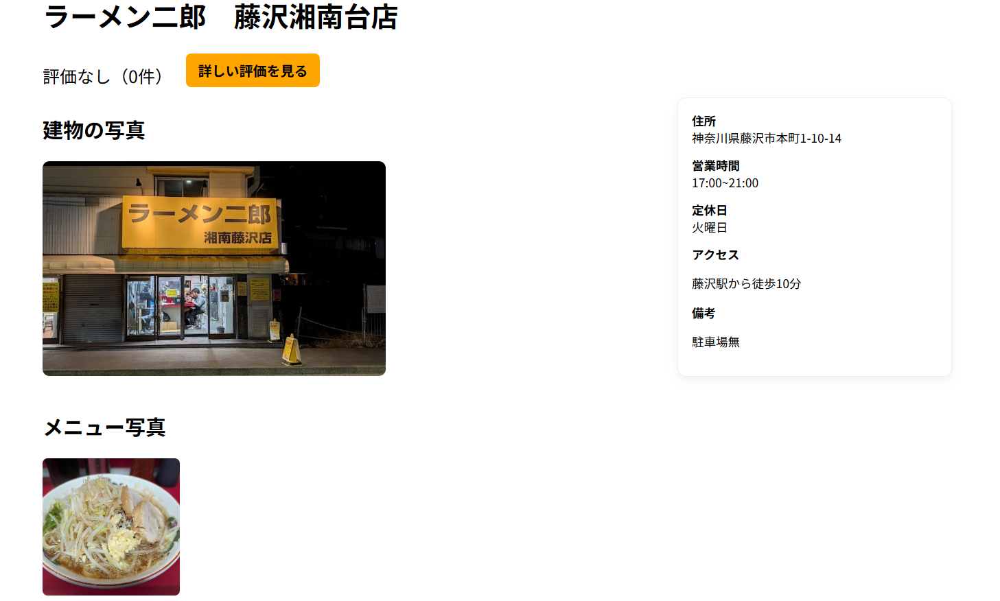

# ラーメン二郎リサーチ
ユーザー同士が食べたラーメン二郎の情報共有して自分好みのラーメン二郎を見つけるアプリです
 
## 1. 概要
ラーメン店の情報と口コミを共有できるWebアプリです。
店舗ごとの評価を可視化し、
「初めて行く店舗選びの不安」を解消することを目指しています。
## 2.サービスの画像

## 3.サービスのURL
https://pacific-tor-87564-ea572241583d.herokuapp.com/

## 4.開発背景
ラーメン二郎は店舗ごとに好みが分かれやすいジャンルです。
・年代による「量・濃さ・満足感」の感じ方の違い
・別による「ボリューム・トッピング・入りやすさ」の印象の違い
・来店か常連かによるハードルの高さ
といった要素が、口コミサイトでは十分に可視化されていないと感じました。
既存のレビューサービスでは、「評価は高いが自分に合うか分からない」
といった不安が残りがちです。
そこで本サービスでは、年代・性別などの属性と口コミを紐づけて可視化することで、
ユーザー自身の価値観に近い評価を参考にできることを目的としました。
「自分と似た立場の人がどう感じたか」を知ることで、
初めて訪れる店舗でも安心して来店してほしいと考えています。
また、都心部と地方店舗では営業開始・終了時間に差があると考え、特に地方店舗では、「行ったのに空いていなかった」 という体験は少なくありません。
そこで本サービスでは、
現在時刻を基準に「今空いているお店」を絞り込んで表示する機能を実装しました。
地域差のある営業時間を意識せずとも、
「今行ける店舗」を探せることを目指しています。

## 5.主な機能
ユーザー登録 / ログイン
店舗の新規登録
店舗写真・メニュー写真のアップロード
口コミ投稿・星評価
詳細評価ページ（集計表示）

## 6.技術スタック
Ruby on Rails
ActiveStorage
Cloudinary（画像ストレージ）
PostgreSQL
Heroku
HTML / CSS /javascript
Git/Github (バージョン管理)
8.今後の展望
口コミの絞り込み機能（年代・性別・評価別）
お気に入り店舗機能の追加
Google Maps 連携による店舗位置表示
分析機能の追加(週間レポート、月間レポート等)

テストアカウント
動作確認用に、以下のテストアカウントをご利用いただけます。

メールアドレス：test123@gmail.com
パスワード：123456
